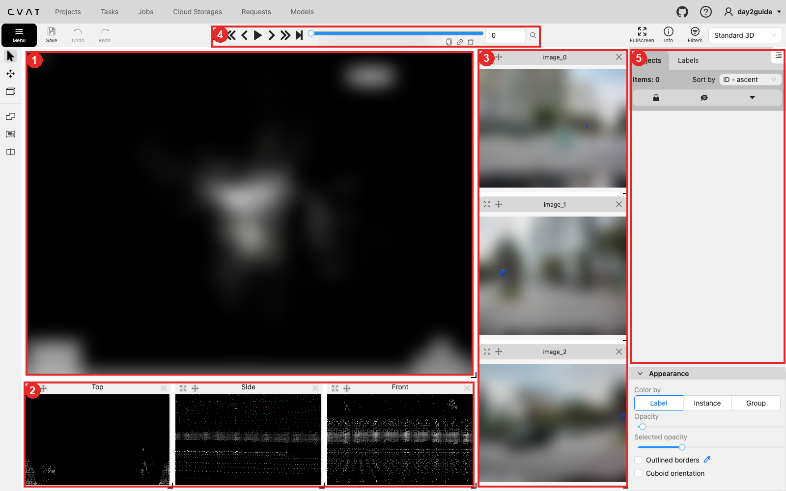
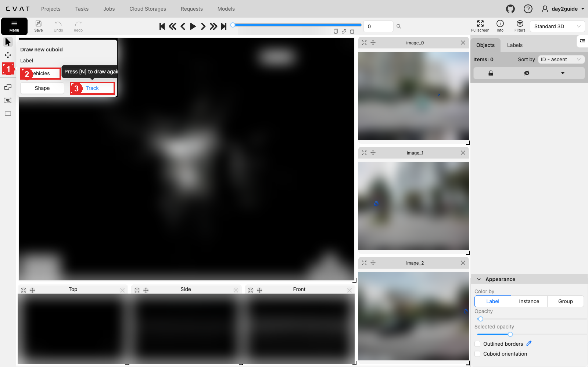
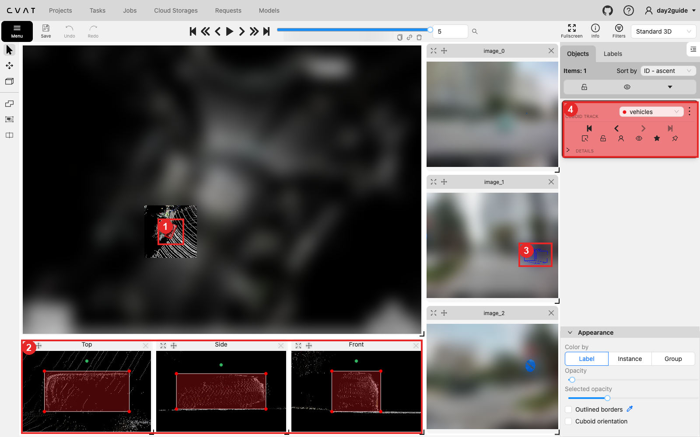
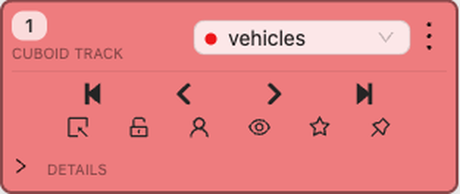
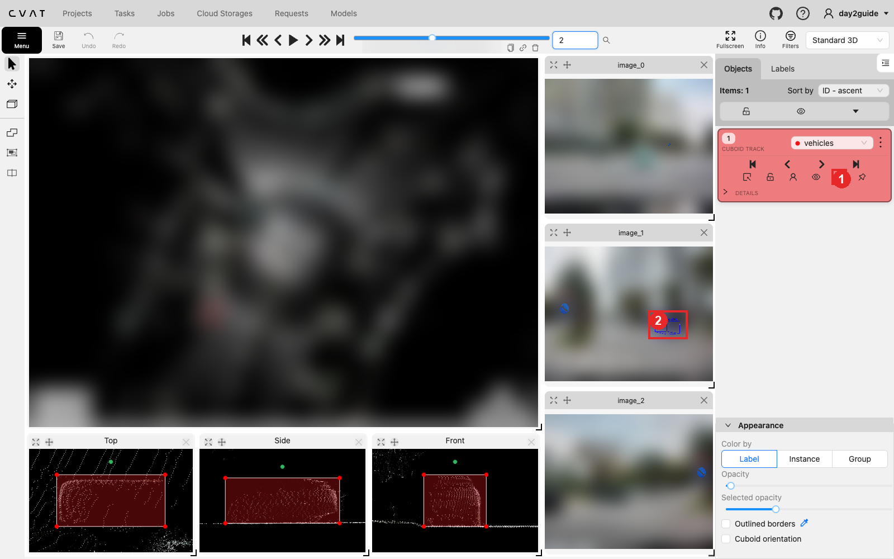
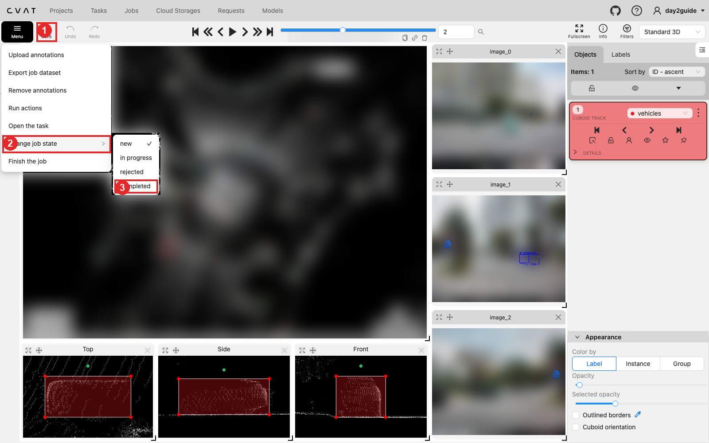

# Hướng dẫn bằng hình: làm một track cuboid trên CVAT 3D

Ảnh chụp trên CVAT local v2.74.1 (Day 2), workspace **Standard 3D**, overlay đang bật. Ví dụ là một job mẫu 6 frame do Coach dùng để demo; job của bạn có số frame và object khác. Ảnh camera và point cloud trong perspective view đã làm mờ, chỉ giữ cuboid đang đánh dấu và nét chiếu màu xanh của overlay. Dữ liệu thật Lab Coach phát đầu buổi; bạn tự tạo task theo README.

Đọc file này cùng [bài lab](lab.md): ở đây chỉ chỉ chỗ bấm, còn lý do và tiêu chí nằm trong bài lab.

## Làm một track từ đầu đến cuối

Ví dụ dưới đây dùng job 6 frame (0–5), locator "frame 5, ROI ở góc phải ảnh `image_1`". Job dài làm y hệt, chỉ thêm keyframe. Với B01 trong task practice của bạn: frame neo 21, ROI trong [danh sách](cases.md), track bắt đầu ở frame 16 và bật `outside` ở frame 22.

1. Mở job, gõ `5` vào ô frame ở thanh trên rồi Enter. Nhìn ô `image_1`, tìm xe nằm trong ROI ghi ở [danh sách](cases.md). Trong perspective view, cuộn chuột zoom tới cụm điểm của đúng xe đó và nhớ vị trí của nó.
2. Lùi bằng `D` về **frame đầu tiên xe xuất hiện** (thường là frame 0). Track chỉ tồn tại từ frame tạo ra nó trở về sau, nên phải tạo ở frame đầu.
3. Tạo track (mục 2): icon cuboid → label `vehicles` → **Track** → click vào giữa cụm điểm của xe. Fit sơ bộ cho hộp ôm cụm điểm.
4. Bấm `F` tới frame xe có **nhiều điểm nhất** (thường là frame gần xe ego nhất). Click cuboid, fit kỹ trên ba view phụ (mục 3):
   - **Top:** kéo thân hộp cho tâm trùng cụm điểm, kéo điểm đỏ cho mép hộp sát mép điểm, kéo chấm xanh lá để cạnh dài song song thân xe.
   - **Side** rồi **Front:** kéo điểm đỏ dưới chạm mặt đường, điểm đỏ trên chạm nóc xe.
5. Xem ô `image_1`: nét xanh của overlay phải bao đúng xe. Lệch rõ thì quay lại Top/Side/Front sửa, không kéo trên ảnh.
6. Mở **DETAILS** trên thẻ track, ghi L/W/H vào phiếu. Đây là kích thước tham chiếu cho cả track.
7. Quay về frame đầu. Ở DETAILS, gõ đúng ba số L/W/H vừa ghi để hộp ở keyframe đầu cùng kích thước, rồi chỉ **kéo thân hộp** và **xoay chấm xanh lá** cho khớp xe.
8. Bấm `F` qua từng frame tới cuối đoạn. Hộp còn ôm xe thì để nguyên (sao rỗng). Lệch thì chỉ dịch/xoay, không kéo điểm đỏ; frame đó thành keyframe (sao đặc). Lỡ đổi kích thước thì gõ lại L/W/H trong DETAILS.
9. Bấm **Save**, tải lại trang, kiểm hộp vẫn còn ở frame đầu, frame fit và frame cuối.
10. Hết bài thì export và chạy QC theo mục Self-QC của [bài lab](lab.md) (mục 6).

Job dài 66 frame làm y hệt: keyframe ở frame đầu, frame cuối và mỗi chỗ xe đổi hướng hay đổi tốc độ rõ. Sau khi đặt keyframe vẫn bấm `F` qua **mọi** frame như bước 8.

Kẹt ở bước nào quá 5 phút, giơ tay gọi Coach.

## 1. Nhận diện workspace

| Số | Vùng | Dùng để |
| --- | --- | --- |
| 1 | Perspective view | Xem point cloud 3D, click chọn cuboid. Kéo chuột để xoay, cuộn để zoom; cụm phím `U I O / J K L` và các mũi tên ở góc cũng điều khiển camera. |
| 2 | Top / Side / Front | Ba hình chiếu của **cuboid đang chọn**. Đây là nơi fit chiều dài, rộng, cao và heading. Chưa chọn object thì ba ô này trống. |
| 3 | Ảnh camera `image_0`, `image_1`, `image_2`… | Ảnh cùng thời điểm. `image_1` là camera trước (CAM_P_F), nơi overlay vẽ cuboid. Rê chuột vào ô ảnh, bấm icon bánh răng để đổi sang camera khác (`image_0`…`image_7`). |
| 4 | Thanh frame | `F` sang frame sau, `D` về frame trước, hoặc dùng các nút mũi tên; gõ số frame vào ô để nhảy thẳng. |
| 5 | Objects | Danh sách object của frame đang xem. Click một item để chọn cuboid đó. |

## 2. Tạo Track, không tạo Shape

1. Bấm icon cuboid ở thanh công cụ trái (số 1).
2. Chọn đúng label (số 2); xe ô tô là `vehicles`.
3. Bấm **Track** (số 3). **Shape** tạo cuboid rời từng frame, không có keyframe hay nội suy, nên không dùng cho bài này.
4. Một cuboid đi theo con trỏ; click vào perspective view tại vị trí object để đặt nó. Sau đó bấm `N` để vẽ lại với cùng thiết lập.

Nếu track đã có sẵn trong job, bỏ qua bước này: chọn item trong Objects rồi sửa.

## 3. Fit cuboid trên Top / Side / Front

| Số | Xem gì |
| --- | --- |
| 1 | Cuboid được chọn trong perspective view (màu của label). |
| 2 | Fit trong ba view phụ: kéo **thân hộp** để dịch, kéo một trong bốn **điểm đỏ** ở góc để đổi kích thước, kéo **chấm xanh lá** để xoay. Top quyết định tâm, chiều dài, chiều rộng và heading; Side/Front quyết định chiều cao và mặt đáy. |
| 3 | Overlay chiếu cuboid lên `image_1`. Dùng để đối chiếu, không dùng để kéo hộp. Muốn bật overlay xem [cvat-overlay.md](cvat-overlay.md). |
| 4 | Thẻ track: dòng chữ `CUBOID TRACK` xác nhận bạn đang làm track. |

Fit ở frame có nhiều điểm nhất trên object trước, rồi giữ L/W/H đó cho các frame khác (lý do ở mục "Vì sao không fit từ frame xa nhất?" trong bài lab).

## 4. Đọc thẻ track: keyframe, outside, occluded

Hàng trên, từ trái sang phải:

- `|<`: keyframe đầu tiên.
- `<` (`E`): keyframe trước.
- `>` (`R`): keyframe sau.
- `>|`: keyframe cuối.

Hàng dưới, từ trái sang phải:

| Icon | Thuộc tính | Phím | Khi nào bật |
| --- | --- | --- | --- |
| ô vuông có mũi tên | outside | `O` | Object ra khỏi phạm vi track theo guideline. Từ frame bật trở đi cuboid bị ẩn; kéo cuboid lại ở frame sau sẽ tạo keyframe mới và track sống lại. |
| ổ khóa | lock | `L` | Khóa để không kéo nhầm. Object đang khóa không sửa được. |
| người | occluded | `Q` | Object bị che. Cuboid vẽ nét đứt; vẫn là cùng track. Bị che chưa có nghĩa là outside. |
| con mắt | hidden | `H` | Chỉ ẩn trên màn hình, không đổi annotation. Object đang ẩn không click được. |
| ngôi sao | keyframe | `K` | Sao **đặc**: frame này là keyframe. Sao **rỗng**: CVAT tự nội suy. |
| ghim | pinned | `P` | Ghim để không lỡ tay kéo hộp. |

Kéo, xoay hay đổi kích thước cuboid ở một frame nội suy sẽ biến frame đó thành keyframe.

## 5. Kiểm frame nội suy

Frame 2 nằm giữa hai keyframe, nên ngôi sao rỗng (số 1). CVAT nội suy tâm, kích thước và góc quay giữa hai keyframe. Đi qua **từng** frame nội suy và xem ba view phụ cùng overlay (số 2). Thấy hộp trôi khỏi cụm điểm thì sửa tại frame đó; frame ấy sẽ thành keyframe mới.

Hai lỗi dễ gặp:

- **Propagate (`Ctrl+B`) không kéo dài track.** Nó biến track thành các Shape rời từng frame. Muốn kéo dài thì sang frame mới và sửa cuboid để tạo keyframe.
- **Hai keyframe khác L/W/H làm hộp co giãn ở giữa.** Giữ một kích thước tham chiếu; ở các keyframe sau chỉ dịch tâm và xoay heading, trừ khi evidence buộc phải đổi.

## 6. Save và export

1. Bấm **Save** (số 1) hoặc `Ctrl+S`. Đợi lưu xong, rồi tải lại trang và kiểm cuboid cùng keyframe vẫn còn.
2. Không cần đổi trạng thái job (số 2, 3). Bài nộp là CSV QC và phiếu trong repo, không phải trạng thái job.
3. Để chạy QC: ra trang task, **Actions** → **Export task dataset** → **Datumaro 3D 1.0**, bỏ tick **Save images**. Giải nén vào `outputs/` rồi chạy lệnh trong mục Self-QC của [bài lab](lab.md).

Đừng dùng **Remove annotations** trong Menu để "dọn" track. Thao tác này xóa luôn lịch sử Undo.
